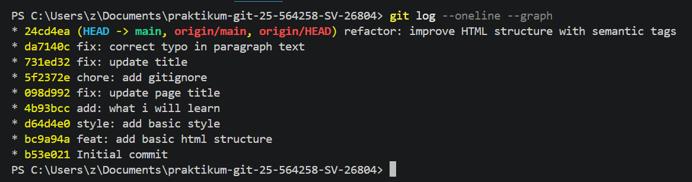

# praktikum-git-25-564258-SV-26804
This repository is part of the Web Programming Practicum 1 coursework, aimed at practicing Git and GitHub concepts such as version control, branching, pull requests, and repository management.

# Praktikum Git

## Screenshot Git Log

