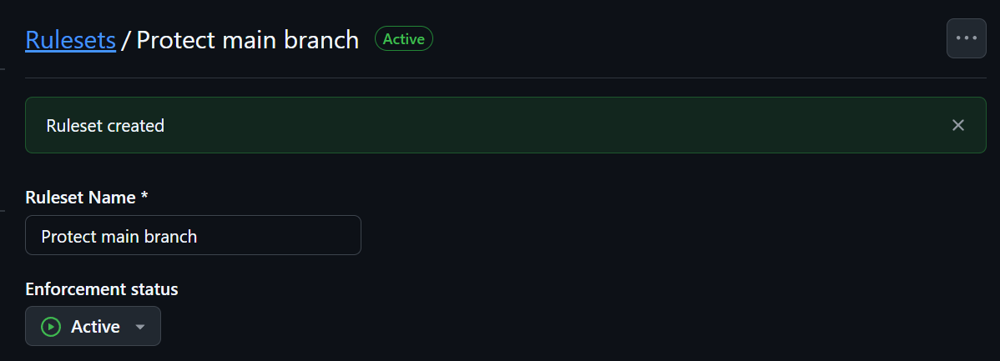
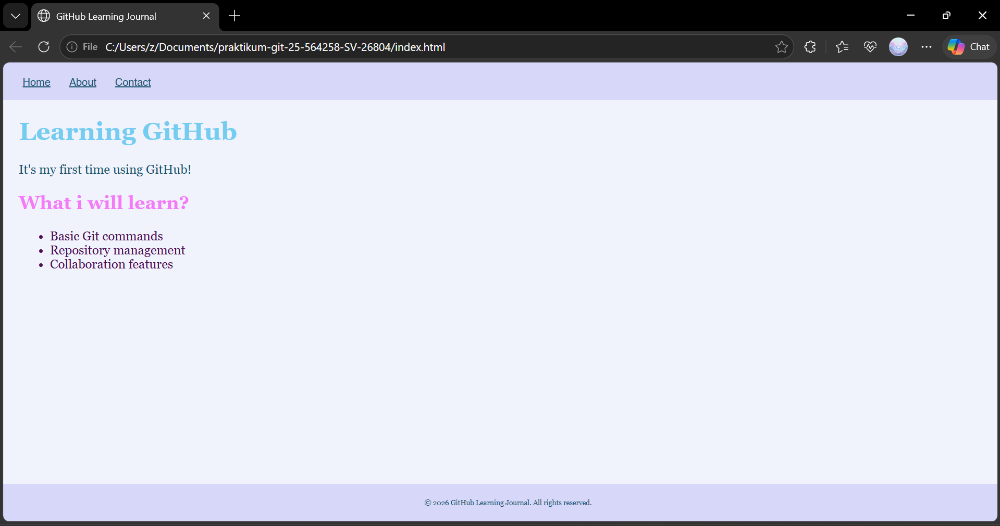

# praktikum-git-25-564258-SV-26804
Repository ini merupakan bagian dari tugas mata kuliah Praktikum Pemrograman Web 1 yang bertujuan untuk mempelajari dan mempraktikkan konsep Git dan GitHub seperti inisialisasi, commit, branching, pull request, branch protection, serta manajemen repository.

## Cara Menjalankan Project

1. Clone repository:
```bash
git clone https://github.com/putribinntang/praktikum-git-25-564258-SV-26804.git
```

2. Masuk ke folder project:
```bash
cd praktikum-git-25-564258-SV-26804
```

3. Buka file `index.html` menggunakan browser.

## Dokumentasi Perintah Git yang Digunakan

### 1. git clone
Digunakan untuk menyalin repository dari GitHub ke komputer lokal.

### 2. git add .
Menambahkan semua perubahan ke staging area sebelum dilakukan commit.

### 3. git commit -m "pesan"
Menyimpan perubahan dengan pesan commit sesuai Conventional Commits.

### 4. git push origin main
Mengirim perubahan dari lokal ke branch main di GitHub.

### 5. git checkout -b nama-branch
Membuat dan berpindah ke branch baru.

### 6. git pull origin main
Mengambil dan menyinkronkan perubahan terbaru dari branch main.

### 7. git rebase -i HEAD~3
Melakukan interactive rebase untuk menggabungkan beberapa commit menjadi satu commit yang lebih rapi.

### 8. git push --force
Digunakan setelah rebase untuk memperbarui commit history di repository remote.

## Sreenshoot Branch Protection


## Screenshot Git Log


## Screenshoot Website


## Author
Putri Mutiara Bintang