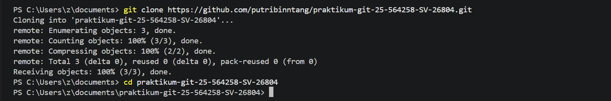
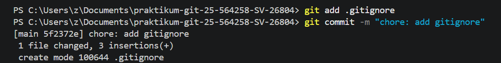
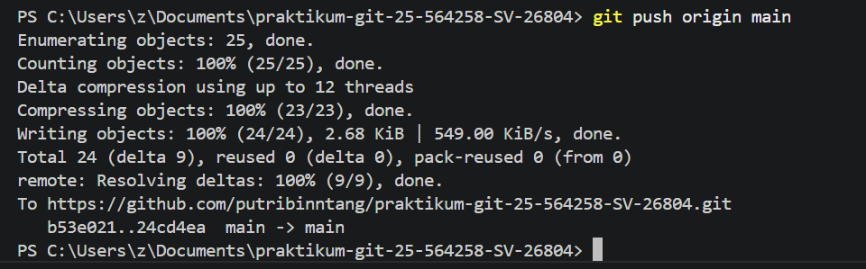
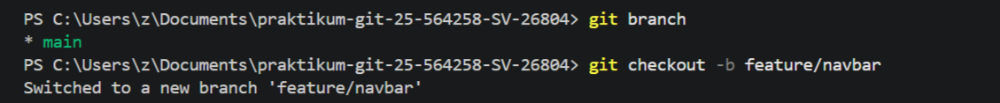
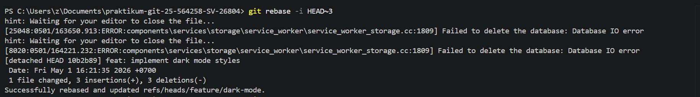
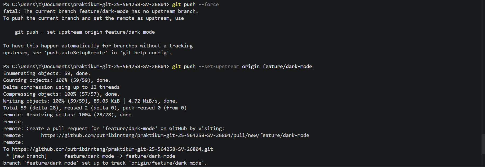
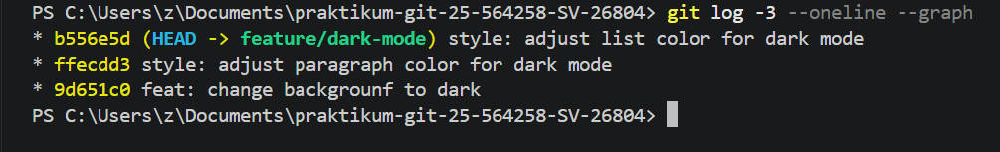

# praktikum-git-25-564258-SV-26804
Repository ini merupakan bagian dari tugas mata kuliah Praktikum Pemrograman Web 1 yang bertujuan untuk mempelajari dan mempraktikkan konsep Git dan GitHub seperti inisialisasi, commit, branching, pull request, branch protection, serta manajemen repository.

## Cara Menjalankan Project

1. Clone repository:
```bash
git clone https://github.com/putribinntang/praktikum-git-25-564258-SV-26804.git
```

2. Masuk ke folder project:
```bash
cd praktikum-git-25-564258-SV-26804
```

3. Buka file `index.html` menggunakan browser.

## Dokumentasi Perintah Git yang Digunakan

### 1. git clone
Digunakan untuk menyalin repository dari GitHub ke komputer lokal.


### 2. git add
Menambahkan semua perubahan ke staging area sebelum dilakukan commit.


### 3. git commit -m "pesan"
Menyimpan perubahan dengan pesan commit sesuai Conventional Commits.


### 4. git push origin "nama branch"
Mengirim perubahan dari lokal ke branch di GitHub.


### 5. git checkout -b nama-branch
Membuat dan berpindah ke branch baru.


### 6. git rebase -i HEAD~3
Melakukan interactive rebase untuk menggabungkan beberapa commit menjadi satu commit yang lebih rapi.


### 7. git push --set-upstream
Digunakan setelah rebase untuk memperbarui commit history di repository remote.


### 8. git log 
Digunakan untuk melihat commit history.


## Sreenshoot Branch Protection


## Screenshot Git Log


## Screenshoot Website


## Author
Putri Mutiara Bintang